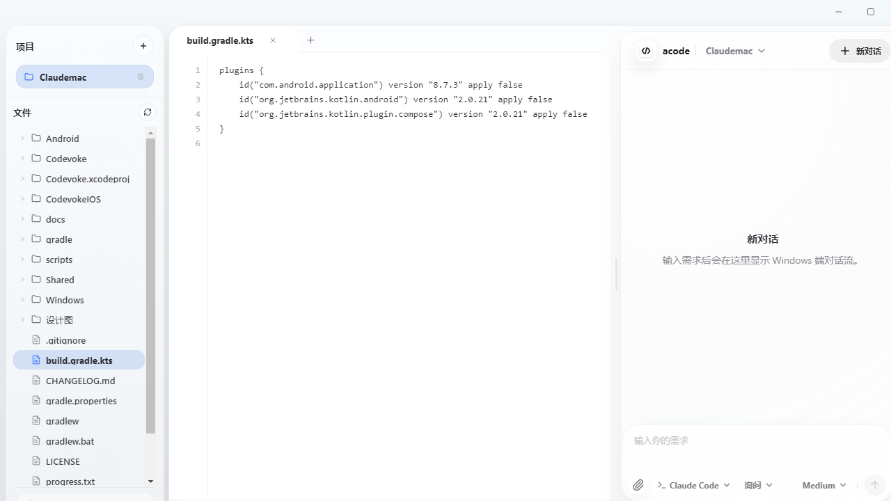
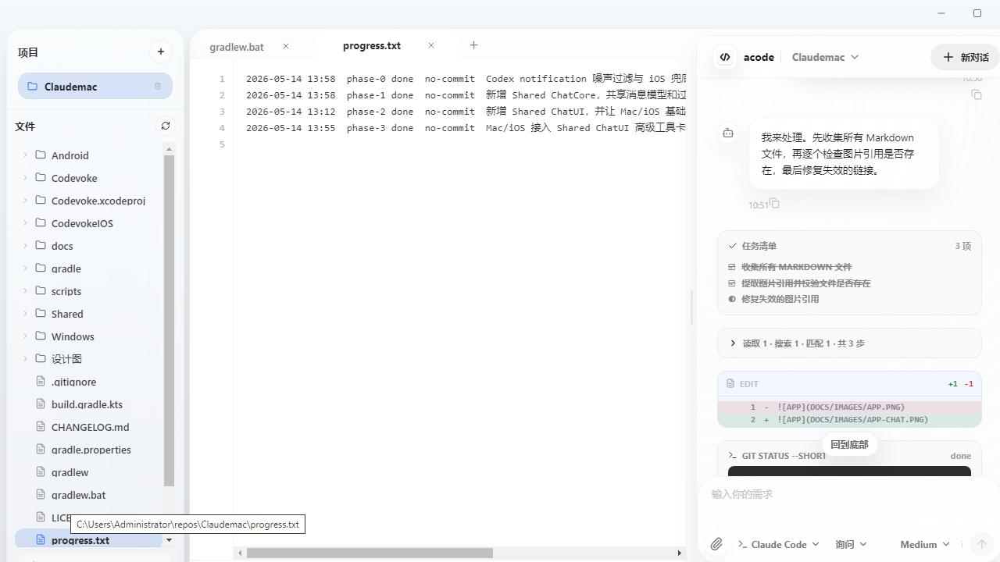
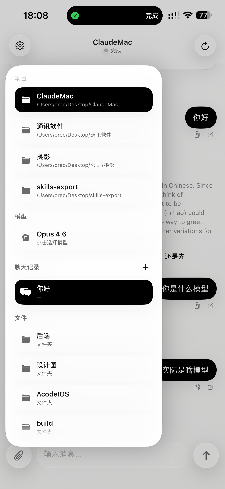

# acode

**手机 AI 编程 —— 把 Claude Code / Codex 装进口袋。**

acode 是一个开源的 AI 编程工作台：在电脑上管理项目、浏览代码、与 Claude Code / Codex 对话；同一 Wi-Fi 下，用手机或平板直接连上电脑，随时随地指挥 AI 看代码、改文件、跑命令、审 diff。

**纯局域网直连 · 无账号 · 无后端 · 无云端依赖 —— 打开就能用。**

仓库地址：<https://github.com/crispvibe/Acode-Desktop>
QQ 交流群：[Code 开源技术交流群](https://qm.qq.com/q/yauE2vZ73y)

<p align="center">
  
  
</p>

## 为什么用 acode

- 📱 **手机 AI 编程**：电脑在干活，人在路上也能继续下达任务、看进度、批权限——通勤、蹲坑、躺沙发都能让 AI 替你写代码。
- 🔌 **零配置连接**：同一 Wi-Fi 下自动发现电脑，点击即连；也可以手动输入 `host:port`。
- 🛠 **完整的工具可视化**：任务清单、文件读取、代码搜索、diff 变更、终端命令、子代理结果……每一步都渲染成对应的卡片，而不是一坨 JSON。
- ⚡ **双引擎**：Claude Code 与 Codex 自由切换，权限模式、推理强度、模型都可以在对话里随手调。
- 🔓 **没有账号体系**：不注册、不登录、不过云。打开应用、开服务、手机连上，结束。
- 🖥 **双桌面 + 双移动端**：macOS（SwiftUI）与 Windows（Electron）都能作为 host，iOS 与 Android 作客户端。

> ⚠️ 连接不做任何鉴权——同一局域网内的任何设备都能连入 host 并驱动 CLI。请在可信网络下使用，不要对公网暴露端口。

## 界面

| 桌面工作台（项目 + 文件树 + 编辑器 + 对话） | 工具对话（任务清单 / diff / 终端） | 手机端真机截图 |
| :---: | :---: | :---: |
|  |  |  |

## 快速开始

### 1. 在电脑上启动 host

**macOS**（需要 macOS 14+，Xcode 15/16）：

```bash
open "Mac版本/Codevoke.xcodeproj"    # 用 Xcode 打开并运行
# 或命令行构建：
xcodebuild -project "Mac版本/Codevoke.xcodeproj" -scheme Codevoke -configuration Debug build
```

**Windows**（需要 Node.js 20+）：

```bash
cd Windows版本
npm install
npm run dev                    # Electron 开发模式
# 或打包安装包：npm run dist:win
```

启动后 host 内置 HTTP + WebSocket 服务，默认监听 **18765** 端口。

### 2. 在手机上连接

**Android**：

```bash
cd 安卓版本 && ./gradlew assembleDebug   # 生成 app-debug.apk 安装
```

**iOS**：

```bash
open "iOS版本/Codevoke.xcodeproj"        # Xcode 构建到真机/模拟器
```

手机与电脑连同一 Wi-Fi，应用会自动扫描局域网里的 acode host，点击即连；扫描不到就在连接页手动输入电脑的 `IP:18765`。

然后就能在手机上：发起新对话、继续上次会话、看工具执行过程、批准/拒绝权限请求、回答 AI 的提问。

## 平台与目录

| 平台 | 角色 | 目录 |
| --- | --- | --- |
| macOS（SwiftUI 原生） | 工作台 + 局域网 host | `Mac版本/` |
| Windows（Electron + React + TS） | 工作台 + 局域网 host | `Windows版本/` |
| iOS（SwiftUI） | 移动端客户端 | `iOS版本/` |
| Android（Kotlin + Compose） | 移动端客户端 | `安卓版本/` |
| 共享聊天核心 / UI（SwiftPM） | macOS/iOS 共用 | `共享代码/` |
| 文档 / 截图 | 协议、打包、设计说明 | `文档/` |
| 辅助脚本 | 打包 / 图标 / 验证 | `脚本/` |
| UI 设计稿 | 连接页 / Android 基准 / 官网 | `设计图/` |

## 连接模型

- `GET /health` —— 存活探测 / 子网扫描发现。
- `WS /chat` —— 面板镜像通道：host 推送 `PanelStateEnvelope`（snapshot/patch），客户端回发 `command`，host 回 `command_ack`。
- `POST /attachments` —— 聊天附件直传。

协议细节见 `文档/remote-chat-v2-protocol.md`、`文档/remote-chat-vnc-refactor.md`。

## macOS 打包签名（可选）

```bash
CODEVOKE_SIGNING_AUTHORITY="Developer ID Application: Your Name (TEAMID)" \
CODEVOKE_TEAM_ID="TEAMID" \
脚本/package-macos-app.sh
```

`NOTARIZE=1` 可触发公证流程（需先配置 `codevoke-notary` keychain profile，见 `文档/macos-notarization.md`）。

## 文档

- `文档/` —— 协议说明、macOS 打包/公证、历史重构记录
- `Windows版本/README.md`、`Windows版本/docs/architecture.md` —— Windows 端架构
- `安卓版本/DESIGN.md` —— Android 端设计说明
- `CHANGELOG.md` —— 版本记录

## 许可协议

**acode 仅供个人非商业使用，禁止商用。**

- ✅ 允许：个人使用、学习、研究、二次开发、非营利组织使用
- ❌ 禁止：出售、收费服务、公司内部生产使用、嵌入商业产品等一切商业用途
- 分发或修改后再发布时，必须附带 [LICENSE](LICENSE) 全文与版权声明

协议采用 [PolyForm Noncommercial License 1.0.0](https://polyformproject.org/licenses/noncommercial/1.0.0)，详见 [LICENSE](LICENSE)。

## License

[PolyForm Noncommercial 1.0.0](LICENSE) · © 2026 crispvibe · [Acode-Desktop](https://github.com/crispvibe/Acode-Desktop) · QQ 群：[Code 开源技术交流群](https://qm.qq.com/q/yauE2vZ73y)
