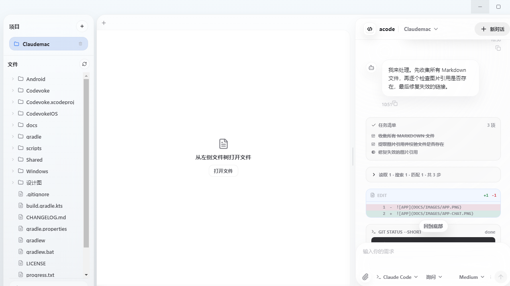
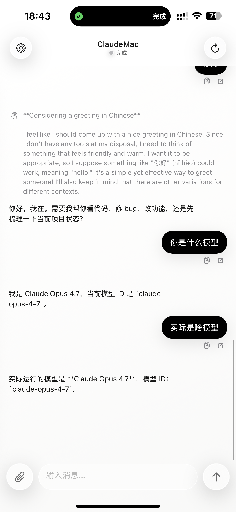

# acode

**中文** · [English](README_EN.md)

> 手机 AI 编程——把 Claude Code / Codex 装进口袋。

开源的局域网 AI 编程工作台：在电脑上跑 Claude Code / Codex 对话，同一 Wi-Fi 下用手机直接连上去指挥它干活。**无账号、无后端、无云端**，打开就能用。

仓库：<https://github.com/crispvibe/Acode-Desktop> · QQ 群：[Code 开源技术交流群](https://qm.qq.com/q/yauE2vZ73y) · License：[PolyForm Noncommercial 1.0.0](LICENSE)（个人免费，禁止商用）

<p align="center">
  
  
</p>

## 它能干什么

- 📱 **手机指挥电脑里的 AI**：发任务、看进度、批权限、回答 AI 的提问，人不在电脑前也能让 AI 继续写代码
- 🔌 **零配置连接**：同一 Wi-Fi 下自动发现电脑，点击即连；也可以手动输入 `IP:18765`
- 🛠 **每一步都看得见**：任务清单、读文件、搜索、diff、终端命令、子代理，全部渲染成对应的卡片
- ⚡ **双引擎**：Claude Code / Codex 随时切换，模型和推理强度在对话里随手调
- 🔓 **没有账号体系**：不注册、不登录、不过云，打开就完事
- 🖥 **四端**：macOS / Windows 当电脑端，iOS / Android 当手机端

## 快速开始

**电脑端**（任选一个当 host）：

```bash
# macOS：Xcode 打开工程运行
open "Mac版本/Codevoke.xcodeproj"

# Windows：Node.js 20+
cd Windows版本 && npm install && npm run dev
```

**手机端**：

```bash
# Android：生成 apk 安装
cd 安卓版本 && ./gradlew assembleDebug

# iOS：Xcode 构建到真机
open "iOS版本/Codevoke.xcodeproj"
```

**连接**：手机和电脑连同一个 Wi-Fi，App 会自动扫描局域网里的 acode；扫不到就在连接页手动输入电脑的 `IP:18765`。

## 安全提示

> ⚠️ **连接没有任何鉴权**——同一局域网里的任何设备都能连上你的电脑并驱动 CLI。只在可信网络下使用，**不要把 18765 端口暴露到公网**。

## 已知缺口：跨网远程（内网透传）

目前只支持**同一 Wi-Fi 下的局域网直连**。跨网远程访问（NAT 穿透 / 内网透传）之前只做了一半，还没做成功——这是这个项目现在最大的短板。

如果你是懂 P2P / NAT 穿透 / 内网透传的开发者，欢迎来补齐它：协议层和目录结构都在（`共享代码/`、各端 `RemoteChat` 模块），改完提 PR 就行。

## 目录结构

- `Mac版本/` —— macOS 电脑端（SwiftUI + 局域网服务）
- `Windows版本/` —— Windows 电脑端（Electron + React + TS）
- `iOS版本/` —— iOS 客户端（SwiftUI）
- `安卓版本/` —— Android 客户端（Kotlin + Compose）
- `共享代码/` —— macOS/iOS 共用的协议与 UI（SwiftPM：ChatCore / ChatUI）
- `文档/` —— 协议说明、macOS 打包/公证
- `脚本/` —— 打包 / 图标 / 验证 / WS 调试
- `设计图/` —— Android 端设计基准

协议：`GET /health`（发现）· `WS /chat`（面板镜像 + 命令通道）· `POST /attachments`（附件），细节见 `文档/remote-chat-vnc-refactor.md`、`文档/remote-chat-v2-protocol.md`。

## 关于这个项目

这个项目最初是想做成付费产品的。做了一阵发现当时的模型能力达不到设想的要求，商业化这条路走不通，本来打算卖掉；后来想想还是算了——与其放着吃灰，不如开源出来，让它成为大家的东西。

目前绝大部分代码是作者一个人写的，也感谢参与过的贡献者 [@909693mr.zeng](https://github.com/909693)，以及每一位提过建议的朋友。

觉得有用就点个 Star，想一起玩就加 QQ 群：[Code 开源技术交流群](https://qm.qq.com/q/yauE2vZ73y)。

## License

[PolyForm Noncommercial 1.0.0](LICENSE)：个人使用、学习研究、二次开发、非营利用途随意；**禁止一切商业用途**。分发或修改后再发布需附带 LICENSE 全文与版权声明。

© 2026 crispvibe · [Acode-Desktop](https://github.com/crispvibe/Acode-Desktop)
